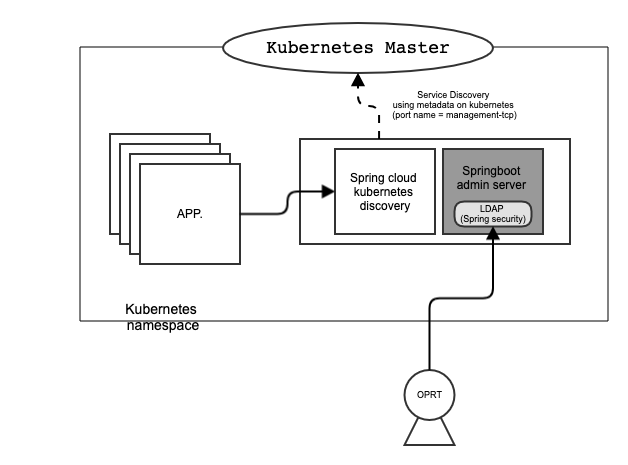

# springboot-admin-with-kubernetes
* SpringBoot Admin with Kubernetes service discovery. I replaced Netflix Eureka to kubernetes discovery.
* If you have kubernetes cluster and deploy onto container, You don't need to use Netflix Eureka. kubernetes discovery is better solution than Eureka.
I strongly recommend to consider use k8s-discovery.

#### FYI
This sample project implemented three features of spring cloud.
* Login with LDAP
* Service discovery on kubernetes using metadata using spring cloud kubernetes discovery. for example, tcp port name(management-tcp)
* (WIP) Service Discovry  on kubernetes using metadata using custom implementation.

#### Flow

